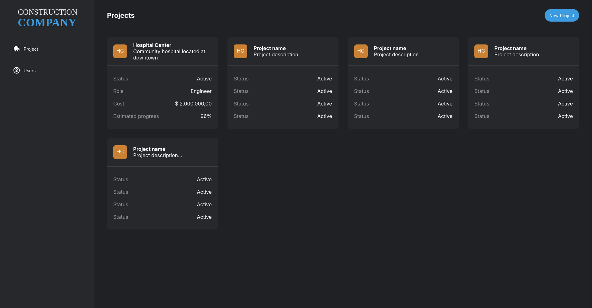

<div align="center">
  <h1>Master BIM Software Developer</h1>
  <p>A comprehensive solution for Building Information Modeling development</p>
  <br>
  
  <br>
  <br>
</div>

<div align="center">
  
  
  
  
</div>


## 🚀 Getting Started

### Prerequisites

- [Node.js](https://nodejs.org/) (v14 or higher)
- [Yarn](https://yarnpkg.com/) package manager

### Installation

1. Clone the repository
```shell
git clone https://github.com/pimentafm/thatopen-masterbim.git
cd thatopen-masterbim
```

2. Install dependencies
```shell
yarn
```

3. Start the development server
```shell
yarn dev
```

Developed by Fernando Pimenta [My Github!](https://github.com/pimentafm) :bird: :sunglasses:
